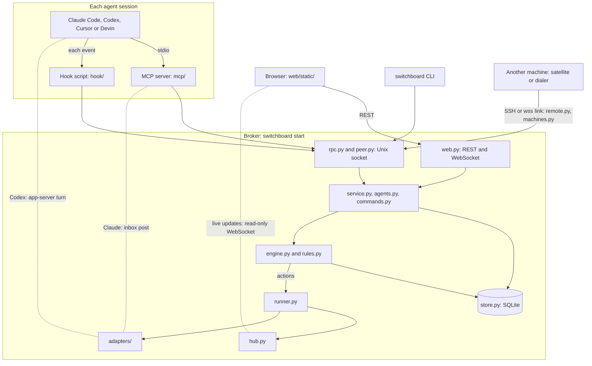

# switchboard: architecture

A short map of the code for a new contributor or coding agent: the parts, the path of a message, the rules that keep that shape, and where [DESIGN.md](DESIGN.md) says more. DESIGN.md is the design, and wins wherever the two disagree.

## The parts

You start each agent yourself; switchboard never launches one or types into it. `switchboard install` registers an MCP server and a hook script with each harness, and a local broker does the rest. Paths are under `src/switchboard/`.

| Part | What it does | Design |
|---|---|---|
| **Broker** `broker/` | One daemon, `switchboard start`: HTTP for the web UI (on `127.0.0.1` unless hosted), a Unix socket for the rest. The only writer to SQLite, and the only place decisions are made. `peer.py` knows callers by the kernel's peer pid, `agents.py` takes agent calls and hook events, `hub.py` fans out. | [§1](DESIGN.md#1-overview), [§2](DESIGN.md#2-runtime-layout), [§5](DESIGN.md#5-local-protocol-and-auth) |
| **Delivery engine** `delivery/` | Who hears what, and when: `rules.py` is pure policy, `engine.py` a synchronous core that returns actions, `runner.py` the async side that carries them out. | [§8](DESIGN.md#8-delivery-engine-deliveryenginepy-deliveryrulespy-deliveryrunnerpy) |
| **Adapters** `adapters/` | One per harness. `route()` picks how to reach it and `send()` does it: Claude's inbox, a Codex turn, Devin's open `wait()`, Cursor's parked stop hook. | [§9](DESIGN.md#9-harness-adapters) |
| **MCP server** `mcp/` | `switchboard mcp`, one stdio process per agent session. Its tools (`join`, `say`, `read`, `wait`, `pass` and a few more) are the agent's whole interface. | [§6](DESIGN.md#6-mcp-server-switchboard-mcp) |
| **Hook script** `hook/` | Run by the harness on each event. It reports the session's state and the batch tokens it saw, and prints the reply the broker allows: context after a tool call, a continue at stop. | [§7](DESIGN.md#7-hook-script-srcswitchboardhookswitchboard_hookpy) |
| **Web UI** `web/static/` | Plain JavaScript. Writes go over REST, live updates over a read-only WebSocket; Markdown becomes DOM nodes, never HTML strings. | [§29](DESIGN.md#29-the-native-web-ui-and-the-inspector-19), [§5.5](DESIGN.md#55-rest-and-websocket) |
| **Remote links** `broker/remote.py`, `broker/machines.py`, `remote/` | One link per other machine: the broker dials it over SSH (`switchboard satellite` at the far end), or it dials a hosted broker over `wss://`. The far end vouches for that machine's processes, and the broker trusts it for that machine's members only. | [§27](DESIGN.md#27-remote-members-over-ssh-m8), [§31.7](DESIGN.md#317-the-dial-in-link) |

Also: `cli.py`; `install/` ([§9.7](DESIGN.md#97-install-targets-switchboard-install-h)); `envelope.py` ([§8.6](DESIGN.md#86-envelope-enveloperender_batchitems-header_ctx-peer_inline)); `store.py`, `db.py` and `models.py` ([§4](DESIGN.md#4-data-model-sqlite)); `guardrails.py` ([§11](DESIGN.md#11-security-model)).

## The path of a message

1. **Posted** in the web UI (`web.py`), with `switchboard say`, or by an agent's `say` through its MCP server and the socket.
2. **Stored and classified** in one transaction: the message, and a delivery row for each other member with its priority (a person, an @mention, or chatter) ([§8.1](DESIGN.md#81-classification-on-insert-in-the-same-transaction-as-the-message)).
3. **Fanned out** by the hub to browsers and `tail`.
4. **Decided per recipient.** `rules.releasable` says whether anything can go now (nothing in a paused room or to a held member, no wake past the budget unless a person wrote, priority only to a busy agent), the adapter's `route()` says how, and the engine returns an action ([§8.2](DESIGN.md#82-engine-core-and-runner)).
5. **Delivered** by the runner through the adapter, or by the agent's hook at its next tool call, or at its next `read()`, `wait()` or `say()`.
6. **Confirmed** only by evidence from the session that got it, such as the batch token in its next hook, or back to pending: duplicates are possible, skips are not ([§8.7](DESIGN.md#87-offers-confirmation-and-expiry-two-phase-ack-event-based)).
7. **Answered** with `say()`, back to step 1, or `pass()`.

All along, hooks report each session's state, and nothing is delivered to a session waiting on an approval.

## The shape to keep

From [CLAUDE.md](../CLAUDE.md). Each rule keeps some part easy to test or to change.

- **SQL only in `store.py`,** with the schema, migrations and connection helpers in `db.py`: one file changes with the schema, and the store's tests run every query.
- **Policy pure in `rules.py`:** no store, clock or I/O, so each rule has a plain unit test.
- **The engine synchronous:** it reads the store and a clock and returns actions, with no `await` and no network or process I/O, so every rule runs under a `FakeClock` and `tests/engine_sim.py` drives it through 200 seeds.
- **Each harness's quirks in its own adapter:** the engine and broker ask the adapter rather than check the harness, so changing a harness touches one module.
- **The hook standalone:** standard library only, nothing from switchboard, every path exits 0, because a failed import or a non-zero exit could block the harness's prompt.
- **A module's docstring names its DESIGN section,** and a design change changes DESIGN.md (a new numbered section for a new piece).

Beside these is the [security model](../CLAUDE.md#the-security-model-in-short) ([§11](DESIGN.md#11-security-model)): switchboard never adds authority, and guards only tighten.

### Where the code doesn't follow them yet

Each is an open issue; don't copy the pattern, and the fix removes its mention here. Harness branches outside the adapters: the engine ([#169](https://github.com/amahpour/switchboard/issues/169)), `agents.py` ([#170](https://github.com/amahpour/switchboard/issues/170)), `catchup.py` ([#171](https://github.com/amahpour/switchboard/issues/171)). File and process I/O under the engine's `route()` call: the Codex adapter ([#172](https://github.com/amahpour/switchboard/issues/172)).

## Where to read next in DESIGN.md

Start with [§1](DESIGN.md#1-overview), the overview and its design principles, and [§3](DESIGN.md#3-package-layout-pyproject-and-cli), the package layout. Then, for what you're changing:

- **Start, stop, the home directory, config:** [§2](DESIGN.md#2-runtime-layout).
- **The schema or a migration:** [§4](DESIGN.md#4-data-model-sqlite), then each version's section ([§27.6](DESIGN.md#276-data-model-schema-v2), [§31.2](DESIGN.md#312-data-model-schema-v3), [§32.2](DESIGN.md#322-data-model-schema-v4), [§37.3](DESIGN.md#373-storage-schema-version-9), [§38.3](DESIGN.md#383-storage-schema-version-10)).
- **The socket, roles, who a peer is, web sign-in:** [§5.2](DESIGN.md#52-methods-and-roles), [§5.3](DESIGN.md#53-peer-identity-and-human-auth-over-the-uds-f11), [§5.4](DESIGN.md#54-web-auth-validated-in-f10-s7-hardened), [§5.5](DESIGN.md#55-rest-and-websocket).
- **An agent's tools, or the hook script:** [§6](DESIGN.md#6-mcp-server-switchboard-mcp), [§7](DESIGN.md#7-hook-script-srcswitchboardhookswitchboard_hookpy).
- **Who hears what, and when:** [§8.2](DESIGN.md#82-engine-core-and-runner) engine and runner, [§8.5](DESIGN.md#85-loop-guard-requeue-watchdog-handled-pause) loop guard, [§8.6](DESIGN.md#86-envelope-enveloperender_batchitems-header_ctx-peer_inline) envelope, [§8.7](DESIGN.md#87-offers-confirmation-and-expiry-two-phase-ack-event-based) confirmation.
- **One harness:** [Claude](DESIGN.md#92-claude-m3-tiers-claudeinbox-and-claudehook), [Codex](DESIGN.md#93-codex-m4-tiers-codexdaemon-and-codexqueue), [Cursor](DESIGN.md#94-cursor-m5-built-from-recorded-contracts-tier-cursorstop-park-provisional), [Devin](DESIGN.md#95-devin-m5-tier-devinwait-loop), [`install`](DESIGN.md#97-install-targets-switchboard-install-h).
- **A slash command:** [§10](DESIGN.md#10-commands), [§26](DESIGN.md#26-catchup-an-agent-gets-up-to-speed-on-another-members-work-a-topic-or-the-room-replaces-review-2026-09-28) `/catchup`, [§28](DESIGN.md#28-closing-and-deleting-rooms-16) closing rooms.
- **A permission, a secret or a guard:** [§11](DESIGN.md#11-security-model) and [SECURITY.md](../SECURITY.md).
- **Tests:** [§12](DESIGN.md#12-test-strategy), and [CONTRIBUTING.md](../CONTRIBUTING.md) for the commands.
- **Other machines, a hosted broker, people:** [§27.4](DESIGN.md#274-the-link) the SSH link, [§27.5](DESIGN.md#275-identity-and-authorization) identity, [§30](DESIGN.md#30-the-container-image-and-the-public-url-34) the image, [§31](DESIGN.md#31-a-hosted-broker-you-use-from-the-web-ui-alone-41) a hosted broker, [§32](DESIGN.md#32-people-a-team-on-one-hosted-broker-61) people, [§38](DESIGN.md#38-sign-in-with-google-70) Sign in with Google, [§39](DESIGN.md#39-identity-by-email-192) identity by email.
- **The web UI:** [§29](DESIGN.md#29-the-native-web-ui-and-the-inspector-19), [§33](DESIGN.md#33-mermaid-diagrams-in-messages-57) diagrams, [§34](DESIGN.md#34-per-person-settings-100) settings, [§35](DESIGN.md#35-custom-room-rules-105) room rules, [§37](DESIGN.md#37-a-review-board-in-a-room-80) review board.

[§15](DESIGN.md#15-implementation-notes-and-deviations-m1) to [§25](DESIGN.md#25-linux-support-2026-09-25) are each milestone's build notes: where it differs from the sections above, and why. F§4 and the like point into [FINDINGS.md](FINDINGS.md), what Milestone 0 measured about each harness.
