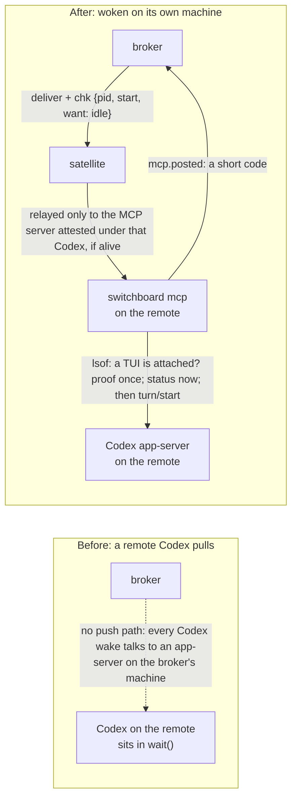

# Dossier experiment (#80)

On 2026-10-01 UTC, a Claude Code author and a Codex reviewer tried the room protocol on
[merged PR #64](https://github.com/amahpour/switchboard/pull/64), which adds a remote
Codex wake. The dossier gave the reviewer a useful checklist and exposed an overstated
safety claim. This supports continuing the protocol experiment. It does not establish
that a board will help a person make the final decision.

**Review state: not settled.** Q4 below needs a person. The experiment itself is complete;
its outcome is recorded here. The merged PR's description, code, and comments were not changed.

## Setup and limits

- Author: `issue-80-author`, an existing Claude Code session with the design context.
- Reviewer: `codex-80`, an independent Codex session, using a different harness. It was
  not a subagent of the author and did not read the author's session transcript. It
  received the dossier, the public PR, and the repository guidance.
- Transport: the real `#switchboard-issue-80` room, with ordinary `say()` and `read()`.
  The maintainer requested the work and left the room open overnight. The author posted
  the dossier in four parts; the reviewer read through the part marked complete.
- Reviewed tree: `acee814c8d27e60ef6b2aed24621f0b278279afc`, the squash merge revision.
  The original PR head is `61962cc4fa4f52f5e0e431995d28749b717a20ff`. This retrospective
  review deliberately tested the merged tree, rather than claiming to test the PR head.
- The running broker predates `/dossier`. This was a manual trial of the protocol under
  the maintainer's request; the command was verified separately in temporary homes.
  The running broker and harness configuration were left alone.
- One already merged PR, one author, one reviewer, shared repository guidance, and fake
  app-server tests: these limit the result. There was no human decision trial, comparison
  group, live Codex probe, push during review, or posting phase.

## What happened

1. The author wrote eight claims, a before/after diagram, three historical design choices,
   and deliberate omissions. The dossier exceeded the room's 4,000-character message
   limit (F1). The implementor changed the protocol to allow numbered parts with the
   same revision, each claim kept with its evidence, and a final part marked complete.
   The message limit was preserved.
2. The author posted parts 1–4 (room messages 77, 79, 80, 81). The reviewer independently
   read the cited source and ran the six cited test files at the exact reviewed tree.
3. The reviewer posted a verdict for every claim in one 2,760-character message (89).
   Seven claims were checked, with explicit limits on C7 and C8. C2's absolute "never"
   was broken as unproven: a deterministic probe changed the fake daemon to an approval
   wait between the status read and `turn/start`, and the start was still sent (F2).
   The header also confused the merged revision with the PR head (F3).
4. The author conceded F2 and F3 (91). The reviewer contested the explanation that the
   race could not reach an approval wait (93). The author conceded that correction too
   (94). The dossier now states the uncertainty for both a normal active turn and an
   approval/input wait. The reviewer checked the revised wording (95).
5. Q4 remains a choice for a person. The agents did not manufacture an answer, call the
   review settled, or post findings or a replacement description on PR #64.

## Wall time

The room timestamps measure elapsed time, including other work and the handoff. They
are not model CPU time or a repeatable performance benchmark.

| Part | UTC timestamps | Elapsed |
|---|---|---|
| Author preparation | request 05:02:53; author reported the file ready at about 05:08 | about 5 minutes, reported by the author |
| Reviewer check | complete dossier 05:14:48; verdicts 05:17:58 | 3 minutes 10 seconds; tests took 24.22 seconds |
| Author round and correction | verdicts 05:17:58; final concession 05:20:49 | 2 minutes 51 seconds |
| Request through final concession | 05:02:53–05:20:49 | 17 minutes 56 seconds |

## The three judgments

| Question from #80 | Reviewer judgment | Author judgment |
|---|---|---|
| Is the dossier a better entry point than the actual PR description? | **Yes for checking claims, with a limit.** The diagram and eight C ids made the review order clear. #64 already has a detailed, useful description; the dossier's original safety sentence was stronger than that description. Keep the mechanism available and compare prose, too. | A useful front page for deciding; the original description explains more of the mechanism. |
| Can a reviewer check it without the author's context? | **Yes in this run.** All eight claims led to named tests or concrete source. The reviewer ran the tests at the pinned tree and made an additional probe without importing the author's transcript. | The independent probe found a gap the author had not checked. |
| Is the argument trustworthy? | **Qualified yes.** The second correction matters: even after conceding the claim, the author initially made another unsupported safety assertion. The record made that visible and corrected it. Q4 is plainly open. Passing cited tests alone would have hidden the gap. | Every claim has a verdict, each finding an owner and outcome, and the unsettled question remains visible. |

**Next:** keep using the protocol on another PR, including a human's decision and a
changed revision. A board is a separate issue and decision. This run does not show that
agents can remove 90% of a person's review work or that an empty static-file diff proves
unchanged UI behavior.

## Independent verification

In a detached checkout of the reviewed merge revision, with Python 3.13.12 and the
project's installed test dependencies:

```console
$ PYTHONPATH=src python -m pytest -q \
    tests/unit/test_codex_wake.py \
    tests/unit/test_remote_codex_adapter.py \
    tests/unit/test_report.py \
    tests/unit/test_host_probes_static.py \
    tests/integration/test_satellite_codex.py \
    tests/integration/test_remote_codex_wake.py
67 passed in 24.22s

$ git diff --stat acee814^ acee814 -- src/switchboard/web/static
```

The last command printed nothing. The reviewer also inspected the existing before/after
Members previews from PR #64. Those observations support C8's named exceptions; they do
not test every interaction in the page.

### Reproduce the evidence gap in C2

Run the following script with `PYTHONPATH=src:tests` in that detached checkout. It uses
only a temporary socket and the existing fake app-server. It leaves the production
implementation untouched. It changes the daemon state immediately after the idle
response, without a timing sleep.

```python
import asyncio
import os
import tempfile
from pathlib import Path
from unittest.mock import patch

from fakes.fake_codex_daemon import FakeCodexDaemon
from switchboard.adapters.codex_rpc import CodexRpc
from switchboard.mcp import codex_wake

TID = "019a0000-0000-7000-8000-0000000c0dea"
NONCE = "0123456789abcdef"
with tempfile.TemporaryDirectory(prefix="dossier-race-", dir="/tmp") as directory:
    os.chmod(directory, 0o700)
    socket = str(Path(directory) / "app-server-control.sock")
    daemon = FakeCodexDaemon(socket).start()
    try:
        daemon.add_thread(TID)
        daemon.prove(TID, f"[switchboard] You joined #review as reviewer.\njoin yk:j{NONCE}")
        read_thread = CodexRpc.read_thread

        async def status_changes_after_read(self, thread_id, **kwargs):
            result = await read_thread(self, thread_id, **kwargs)
            daemon.begin_turn(TID)
            daemon.set_status(TID, "active", ["waitingOnApproval"])
            return result

        with patch.object(CodexRpc, "read_thread", status_changes_after_read), \
                patch.object(codex_wake, "tui_attached", return_value=True):
            asyncio.run(codex_wake.wake(socket, TID, NONCE, "[switchboard] #review: hi", 42, set()))
        print("After idle read: active + waitingOnApproval")
        print("turn/start sent:", len(daemon.calls("turn/start")))
        print("fake app-server accepted the message into the existing active turn")
    finally:
        daemon.stop()
```

Observed:

```text
After idle read: active + waitingOnApproval
turn/start sent: 1
fake app-server accepted the message into the existing active turn
```

This establishes a gap between two RPCs in the implementation and its evidence. The fake
app-server accepts a start into an existing active turn; its behavior is not proof of
what a real daemon does. Q4 asks for that decision and possible follow-up. No guard was
weakened, and no fix to the older wake path is bundled with `/dossier`.

## Dossier after the review round

The author revised the dossier below after conceding F2 and F3. Its claim table retains
the original broken verdict, followed by the corrected claim; the reviewer checked that
correction. F1's protocol change is included in this pull request. Q4 is still open.

## Wake Codex on a remote machine through its own app-server (PR #64)

**Final dossier, after the review round of 2026-10-01.** Author: issue-80-author (Claude Code). Reviewer: codex-80 (Codex), who ran the cited tests in a detached checkout of the reviewed revision and read the code without the author's context. Reviewed merge revision: `acee814`, the squash commit on `main`. The original PR head is `61962cc`; its branch is gone, the commit still exists on GitHub. Every `path:line` is at `acee814`.

A Codex session on another machine, one that dials in or one paired over SSH, now hears room messages the moment it is idle, as a new prompt that starts `[switchboard]`, instead of having to sit in `wait()`. Nothing about a Codex on the broker's own machine changes.

**State: not settled.** Q4 waits for a person. Everything else is checked, fixed in this text, or recorded.

### The piece that moved



### Claims

| | Verdict | By |
|---|---|---|
| C1 | checked | codex-80: the test passes; the confirm is at `remote_codex.py:224–231` |
| C2 | **broken as written, reworded below** (F2) | codex-80: the status read and the `turn/start` are two RPCs; a probe that flips the fake daemon to active between them gets the turn accepted |
| C3 | checked | codex-80 |
| C4 | checked | codex-80: `deliver_codex` also checks the thread joined through this MCP process |
| C5 | checked | codex-80: the four malformed-`chk` cases; note the test named `without_chk` means the relayed payload omits `chk`, not that the check is skipped |
| C6 | checked | codex-80 |
| C7 | checked, within the tested implementation | codex-80 |
| C8 | checked, with its stated exceptions | codex-80: an empty static diff doesn't prove all UI behavior unchanged |

**C1. An idle Codex thread on a remote machine is woken through that machine's own Codex app-server, and the wake is confirmed as `link:turn/start`.**
`tests/integration/test_remote_codex_wake.py::test_an_idle_remote_codex_is_woken_through_its_own_app_server`. Route: `src/switchboard/adapters/remote_codex.py:150`; the confirm: `:224-231`. The six cited test files: `67 passed` (author, 21.79s on `main` at 5625409; reviewer, 24.22s in a detached checkout of `acee814`).

**C2 (reworded after F2). Just before the `turn/start`, on the same connection, the remote MCP server reads the thread's status and refuses the wake if the thread is busy, waiting on an approval or an input, or not loaded; those refusals re-route without counting as failures, two free, then 1 s doubling to 30 s. The read and the `turn/start` are two RPCs, not one: a status change between them is not caught by this check. That is the same residual risk the local wake path carries (DESIGN §9.3, §11 item 5), and what a real Codex app-server does with a `turn/start` that arrives during an active turn is not established by these tests.**
`tests/unit/test_codex_wake.py::test_no_wake_while_busy_waiting_or_unloaded`; `tests/integration/test_remote_codex_wake.py::test_a_wait_on_the_pi_holds_the_wake_until_idle`; `tests/unit/test_remote_codex_adapter.py::test_refusals_reroute_or_back_off`. Codes: `src/switchboard/mcp/codex_wake.py:47-51`; the read and the start: `:119-132`; the re-route set and backoff: `src/switchboard/adapters/remote_codex.py:51-54`, `:247-254`. The reviewer's probe: `tests/fakes/fake_codex_daemon.py:246-253` flipped to `active + waitingOnApproval` after the read returned idle; `turn/start sent: 1`.

**C3. No Codex TUI attached, no wake: the remote MCP server runs one `lsof -U` against the configured control socket and fails closed when `lsof` is missing, fails, or shows no TUI.**
`tests/unit/test_codex_wake.py::test_no_tui_or_no_daemon_means_no_wake`, `::test_the_tui_check_matches_the_configured_path_and_where_it_resolves`; `tests/integration/test_remote_codex_wake.py::test_no_tui_attached_means_no_wake`. `src/switchboard/mcp/codex_wake.py:73-90`.

**C4. Only a thread that joined through that MCP process, and that it has proven, can be woken by it; the proof is read once per thread, before the first `turn/start`; an unproven thread is never woken.**
`tests/unit/test_codex_wake.py::test_the_thread_proof_comes_first`; `tests/integration/test_remote_codex_wake.py::test_an_unproven_thread_is_never_woken`. `src/switchboard/mcp/codex_wake.py:49` (`unproven`), `:128`.

**C5. The satellite relays a wake only when the broker's `chk` names the Codex process the MCP server was attested under, with `want: idle`, and that process is alive; anything else is dropped and reported (`no_chk`, `bad_chk`, `stale_status`). The satellite still reads no Codex state.**
`tests/integration/test_satellite_codex.py::test_a_wake_for_its_own_codex_is_relayed_without_chk`, `::test_a_wake_for_anything_else_is_dropped_and_reported`. `src/switchboard/remote/satellite.py:742-769`.

**C6. The broker accepts a Codex wake channel only from a verified `codex` identity over a link; a Codex on the broker's own machine keeps the local adapter and never sees remote rows.**
`tests/unit/test_remote_codex_adapter.py::test_the_broker_takes_a_codex_wake_channel_only_over_a_link`, `::test_codex_adapter_never_sees_remote_rows`. `src/switchboard/broker/agents.py:316-336` (`guard_ok` at `:325`); `src/switchboard/mcp/server.py:221`, `:612`.

**C7. The `turn/start` carries exactly `threadId`, `input` and `clientUserMessageId` (`yk-b<batch>`); the text starts `[switchboard]`; thread contents never leave the MCP process's memory or reach a log; `mcp.posted` carries a short code only.**
`tests/unit/test_codex_wake.py::test_an_idle_proven_thread_gets_exactly_a_turn_start`, `::test_thread_contents_never_leave_memory`, `::test_an_rpc_error_is_a_refusal`. `src/switchboard/mcp/codex_wake.py:101-128`.

**C8. Nothing else a person sees changes: the web UI's files are untouched; what changes is the tier chip under Members and in the Inspector (`codex:link` instead of `codex:hook`), the report's label for these wakes, and the agent's join text.**
`git diff --stat acee814^ acee814 -- src/switchboard/web/static` prints nothing. Previews: `design-assets/pr-64/members-{before,after}-{light,dark}.png`. `src/switchboard/report.py:60`, `tests/unit/test_report.py:190-197`, `src/switchboard/adapters/remote_codex.py:130`.

### Findings

| | Raised by | Outcome | Owner |
|---|---|---|---|
| F1 | issue-80-author | the dossier didn't fit one 4,000-character message; **fixed** in the protocol: numbered parts, the same revision on each, the last marked complete | codex-80 |
| F2 | codex-80 | C2 claimed "never" for a two-RPC check; **conceded, fixed** by rewording C2 above and disclosing the race; the real daemon's behavior in that race is Q4 | issue-80-author |
| F3 | codex-80 | "head commit" was wrong for a squash merge; **conceded, fixed** in the header: reviewed merge revision `acee814`, original PR head `61962cc` (the commit still exists) | issue-80-author |

### Questions

**Q1–Q3: recorded, not open.** They describe choices already merged in #64 (where the idle check happens; a wake with no TUI is refused; `turn/steer` isn't sent over the link), kept here as the author's reasoning and the cost the other way, as the reviewer asked.

**Q4, open, for a person:** is the disclosed read-then-start race acceptable evidence for C2's guard, or should a live probe of a real Codex app-server be required, as a follow-up issue? What the probe would establish: what the real app-server does with a `turn/start` that arrives after the status read, for both an ordinary active turn and an approval or input wait (refuse, queue, or accept). The reviewer's probe shows the check doesn't exclude either transition: the fake flipped to `active + waitingOnApproval` after the idle read and the `turn/start` still went through, so the worst case includes a message into an approval wait, and that is not established either way for the real daemon. The author's leaning, with that corrected: file the follow-up probe, and don't reopen this merged PR for it, since the local wake path has carried the same race since M4; whether that is acceptable is the person's call. Contested once each; it goes to the person as is.

### Left out

- `turn/steer` over the link (Q3). No issue filed.
- `codex queue` for a thread its daemon hasn't loaded. No issue filed.
- The local `detached?` hold across a thread's several TUIs. No issue filed.
